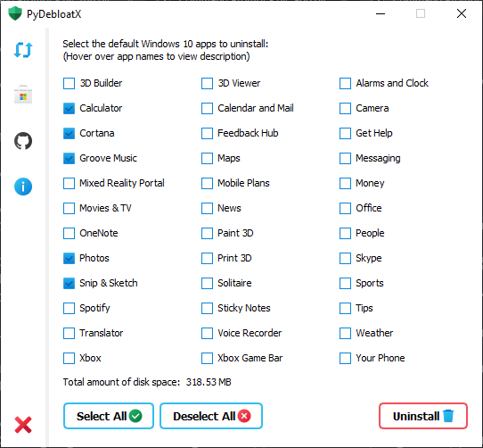

<p align="center">
  
</p>
<h1 align="center">
  PyDebloatX
</h1>

<p align="center">
    A Python GUI for uninstalling the default Windows 10 apps.
</p>

<p align="center">
  <a style="text-decoration:none" href="https://github.com/Teraskull/PyDebloatX/releases">
    
  </a>
  <a style="text-decoration:none" href="https://www.codefactor.io/repository/github/teraskull/pydebloatx">
    
  </a>
  <a style="text-decoration:none" href="https://github.com/Teraskull/PyDebloatX/releases">
    
  </a>
  <a style="text-decoration:none">
    
  </a>
</p>

<div align="center">




</div>


## Shortcuts:

* <kbd>CTRL</kbd> <kbd>R</kbd> - refresh the list of installed apps.
* <kbd>CTRL</kbd> <kbd>G</kbd> - visit the Github page.
* <kbd>CTRL</kbd> <kbd>A</kbd> - view the "About" window.
* <kbd>CTRL</kbd> <kbd>Q</kbd> - quit the app.

## App limitations:

* You cannot uninstall other apps, for example Cortana or Edge. This GUI was designed to be simple and safe, so that you cannot break anything using it.
* App disk space is approximate and taken from Microsoft Store, there is no other way to get real-time app size.
* Currently there is no possibility to track the uninstalling progress in the GUI.

## Dependencies:

* PyQt5
    ```pip install pyqt5```

## Usage:

* ```git clone https://github.com/Teraskull/PyDebloatX```
* ```cd PyDebloatX```
* ```pip install -r requirements.txt```
* ```python app.py``` or ```py app.py```

## License:

This software is available under the following licenses:

  * **MIT**